# Prelude Health — End-to-End Architecture

A voice-first pre-visit intake system: a patient books an appointment, receives an SMS link, and has a live spoken conversation with an AI agent (**AWS Bedrock Nova 2 Sonic**, via the **Strands Agents SDK**) that walks them screen-by-screen through their symptoms and history. A second agent then turns the finished call into a structured PDF report for the physician.

> Rendered with [Mermaid](https://mermaid.js.org/). Renders natively on GitHub and GitLab. If your local viewer shows it unstyled, paste the block into the [Mermaid Live Editor](https://mermaid.live).

## Diagram

```mermaid
flowchart TB

  %% ============================= CLIENT =============================
  subgraph CLIENT["🧑‍⚕️ PATIENT / DOCTOR BROWSER · React 19 + Vite + TypeScript"]
    BOOK(["📅 BookAppointment<br/><small>landing page (/) · visit-type → provider → slot → confirm</small>"])
    TOPBAR(["⚙️ BookingTopBar<br/><small>Register as doctor · View generated report</small>"])
    REPORTUI(["📄 ReportLookup<br/><small>/reports · session id → PDF</small>"])
    RESCHED(["🔁 AppointmentReschedule<br/><small>day-strip + slot picker</small>"])
    ATTACH(["🔑 PrescreeningSessionProvider<br/><small>intake token → session cookie</small>"])
    ENGINE(["🎙️ useIntakeCallEngine<br/><small>mic capture · audio playback<br/>reconnect 1-2-4-8-15s · ping/pong</small>"])
    SCREENS(["📱 Guided Call UI — 11 screens<br/><small>Welcome → ConfirmDetails → PatientConcerns →<br/>SymptomStory → Medication → Allergies →<br/>MedicalHistory → RecentCare → FamilySocialHistory →<br/>ThankYou → EndCall</small>"])
  end

  %% ============================== EDGE ===============================
  subgraph EDGE["🌐 EDGE · FastAPI — /api/v1 (REST) + /ws (WebSocket)"]
    RBOOK["/booking · /mock-booking · /webhooks<br/>/sessions/{id}/appointment<br/><small>catalog · demo & real scheduling · reschedule</small>"]
    RSESS["/sessions/*<br/><small>attach (token→cookie) · consent · ws-ticket mint</small>"]
    RDOC["/doctors/*<br/><small>registration + Google OAuth callback</small>"]
    RREPORT["/sessions/{id}/report[-download-url]<br/>/sessions/{id}/documents · /recording<br/><small>physician report (API-key) · demo link · uploads</small>"]
    WSGATE["/ws/intake/{session_id}<br/><small>BrowserInput · BrowserOutput · CallControl</small>"]
    SECNOTE["🔐 3 scoped HMAC-SHA256 tokens<br/><small>intake · session · ws-ticket (single-use)</small>"]
  end

  %% ============================ SERVICES =============================
  subgraph SVC["🧩 SERVICE LAYER"]
    SESSVC["SessionService"]
    SCHEDSVC["SchedulingService"]
    AVAILSVC["AvailabilityService"]
    QBANKSVC["QuestionBankService"]
    DOCSVC["DoctorRegistrationService"]
    NOTIFY["NotificationService"]
  end

  %% ========================== AGENTIC CORE ============================
  subgraph AGENT["🤖 AGENTIC CORE · Strands BidiAgent — built fresh per call"]
    PROMPT["📜 System Prompt Builder<br/><small>conduct rules + booking context + resume block</small>"]
    STATE["🧠 LiveCallContext + SymptomQuestionPlan<br/><small>screen position · consent · Q&A so far</small>"]
    subgraph TOOLS["🛠️ Tool Belt"]
      direction LR
      TNAV["navigate_to_screen<br/>get_current_screen<br/><small>screen order +<br/>completeness gate</small>"]
      TFIELD["record_intake_details<br/><small>fixed-field<br/>screens</small>"]
      TSYMP["start_prescreening<br/>ask_symptom_question<br/>record_symptom_answer<br/><small>dynamic 7–10 Q<br/>symptom story</small>"]
      TSCHED["cancel_appointment<br/>reschedule_appointment<br/>find_earlier_appointment_slots<br/><small>in-call<br/>reschedule</small>"]
      TUP["request_document_upload"]
      TEND["end_session<br/><small>+ 8s force-end<br/>watchdog</small>"]
    end
  end

  %% ========================== SUMMARIZATION ===========================
  subgraph SUMM["📝 SUMMARIZATION AGENT · post-call, async"]
    SUMAGENT["strands.Agent + BedrockModel (Claude Sonnet)<br/><small>structured_output → PreScreeningReport</small>"]
    DOCDESC["Document description mini-agent<br/><small>vision · type-only · never diagnostic</small>"]
  end

  %% ============================== DATA ================================
  subgraph DATA["🗄️ DATA & STORAGE"]
    MONGO[("MongoDB Atlas<br/><small>sessions · doctors · doctor_registrations<br/>question_bank · appointment_slots<br/>scheduling_events · sweeper_locks · ws_tickets</small>")]
    S3[("Amazon S3<br/><small>reports/{id}/report.pdf<br/>uploaded documents · call recordings</small>")]
  end

  %% ============================ EXTERNAL ==============================
  subgraph EXT["☁️ EXTERNAL / THIRD-PARTY"]
    BEDROCKSONIC{{"AWS Bedrock<br/>Nova 2 Sonic<br/><small>bidirectional speech ↔ speech</small>"}}
    BEDROCKTEXT{{"AWS Bedrock<br/>Claude Sonnet<br/><small>text, structured output</small>"}}
    GCAL{{"Google Calendar<br/><small>service account ∪ per-doctor OAuth</small>"}}
    SMS{{"SMS gateway<br/><small>mocked — logged, not sent</small>"}}
  end

  %% ================================ EDGES =============================
  BOOK -- "GET catalog / availability" --> RBOOK
  BOOK -- "POST book appointment" --> RBOOK
  TOPBAR -- "start OAuth" --> RDOC
  TOPBAR -. "hand off session id" .-> REPORTUI
  REPORTUI -- "GET report-download-url" --> RREPORT
  RESCHED -- "GET availability / POST reschedule" --> RBOOK
  ATTACH -- "POST attach + ws-ticket" --> RSESS
  ENGINE -- "WS connect ?ticket=…" --> WSGATE
  ENGINE <-. "audio · transcript · navigate<br/>form_prefill · symptom_state · call_ended" .-> WSGATE
  SCREENS -.->|driven live by| ENGINE

  RBOOK --> SCHEDSVC
  RBOOK --> AVAILSVC
  RBOOK --> SESSVC
  RSESS --> SESSVC
  RDOC --> DOCSVC
  RREPORT --> SESSVC
  SECNOTE -. secures .-> WSGATE
  SECNOTE -. secures .-> RSESS
  SECNOTE -. secures .-> RREPORT

  WSGATE ==>|"spins up, per connection"| AGENT
  PROMPT --> STATE
  STATE --> TOOLS
  TOOLS -- "gate / record / navigate" --> STATE
  STATE -- "persist progress + answers" --> MONGO
  TSYMP -- "reference Qs + bank update" --> QBANKSVC
  AGENT ==>|"bidi audio stream + tool calls"| BEDROCKSONIC
  TEND -- "call completed" --> SUMM

  SESSVC --> MONGO
  SESSVC -- "intake link" --> NOTIFY
  NOTIFY -.-> SMS
  SCHEDSVC --> MONGO
  SCHEDSVC --> GCAL
  AVAILSVC --> GCAL
  DOCSVC --> MONGO
  DOCSVC -- "OAuth" --> GCAL
  QBANKSVC --> MONGO

  SUMAGENT -- "transcript + collected details + symptom answers" --> BEDROCKTEXT
  SUMAGENT -- "PreScreeningReport" --> MONGO
  SUMAGENT -- "PDF" --> S3
  DOCDESC --> BEDROCKTEXT
  TUP -- "presigned PUT" --> S3
  RREPORT -- "presigned GET" --> S3

  %% ================================ LEGEND =============================
  subgraph LEGEND["🔑 LEGEND"]
    direction LR
    LG1(["Rounded = UI component"])
    LG2["Sharp = API / service"]
    LG3["Sharp violet = agent tool"]:::agent
    LG4[("Cylinder = data store")]
    LG5{{"Hexagon = third party"}}
    LG6["═══ thick = spins up per call"]
    LG7["┄┄┄ dashed = mocked / best-effort"]
  end

  %% ================================ STYLES =============================
  classDef client fill:#EAF1FF,stroke:#3D6FE0,color:#0B2545,stroke-width:1.5px;
  classDef edge fill:#E4FBF6,stroke:#12A594,color:#04372F,stroke-width:1.5px;
  classDef svc fill:#F0F4F8,stroke:#5C6B7A,color:#1B2733,stroke-width:1.5px;
  classDef agent fill:#F2E9FF,stroke:#8B5CF6,color:#3A1461,stroke-width:1.5px;
  classDef tool fill:#F8F1FF,stroke:#B084F5,color:#4B2178,stroke-width:1.2px;
  classDef summarizer fill:#FFF3D9,stroke:#E3A008,color:#4D3300,stroke-width:1.5px;
  classDef data fill:#FFEFE1,stroke:#F0883E,color:#5A2E0B,stroke-width:1.5px;
  classDef external fill:#EEF1F5,stroke:#64748B,color:#1E293B,stroke-width:1.5px,stroke-dasharray: 3 2;
  classDef security fill:#FFE9EE,stroke:#F4708A,color:#6B0F27,stroke-width:1.5px;
  classDef legend fill:#FFFFFF,stroke:#C9CED6,color:#2B2F36,stroke-width:1px;

  class BOOK,TOPBAR,REPORTUI,RESCHED,ATTACH,ENGINE,SCREENS client;
  class RBOOK,RSESS,RDOC,RREPORT,WSGATE edge;
  class SECNOTE security;
  class SESSVC,SCHEDSVC,AVAILSVC,QBANKSVC,DOCSVC,NOTIFY svc;
  class PROMPT,STATE agent;
  class TNAV,TFIELD,TSYMP,TSCHED,TUP,TEND tool;
  class SUMAGENT,DOCDESC summarizer;
  class MONGO,S3 data;
  class BEDROCKSONIC,BEDROCKTEXT,GCAL,SMS external;
  class LG1,LG2,LG4,LG5,LG6,LG7 legend;

  style CLIENT fill:#F7FAFF,stroke:#B9CDF5,stroke-width:1px;
  style EDGE fill:#F2FCFA,stroke:#9FE3D6,stroke-width:1px;
  style SVC fill:#F7F9FA,stroke:#C7CFD6,stroke-width:1px;
  style AGENT fill:#FAF6FF,stroke:#D3B8F9,stroke-width:1px;
  style TOOLS fill:#FFFFFF,stroke:#E3D2FB,stroke-width:1px;
  style SUMM fill:#FFFBF0,stroke:#F5D68A,stroke-width:1px;
  style DATA fill:#FFF7F0,stroke:#F7C79B,stroke-width:1px;
  style EXT fill:#F8F9FA,stroke:#CBD3DA,stroke-width:1px;
  style LEGEND fill:#FFFFFF,stroke:#E3E6EA,stroke-width:1px;
```

## Legend, spelled out

| Symbol | Meaning |
|---|---|
| 🔵 Blue rounded box | UI component (React) |
| 🟢 Teal sharp box | API surface (FastAPI route group) |
| ⚪ Grey sharp box | Service-layer class |
| 🟣 Violet sharp box | Agentic core (prompt builder / live state) |
| 🟪 Light violet box | One live-agent **tool** the model can call |
| 🟠 Amber box | Summarization agent (post-call) |
| 🟤 Orange cylinder | Persistent data store |
| ⬡ Grey hexagon, dashed border | Third-party / external service |
| `═══` thick arrow | Component is spun up fresh per call/connection |
| `┄┄┄` dashed arrow | Best-effort, mocked, or advisory relationship |

## Walking the diagram: one call, start to finish

1. **Booking** — `BookAppointment` calls `/booking/*` for the catalog and `/mock-booking/appointments` (or the real `/webhooks/booking-confirmed`) to create the appointment. That handler books the calendar slot (via `SchedulingService` → Google Calendar), creates the `Session` document in MongoDB (`SessionService`), and hands the patient an intake link through `NotificationService` — currently logged, not actually sent as an SMS.
2. **Attach** — opening the link runs `PrescreeningSessionProvider`: the one-time intake token is exchanged for an HttpOnly session cookie via `/sessions/*`, then stripped from the URL.
3. **Connect** — `useIntakeCallEngine` mints a single-use WebSocket ticket and opens `/ws/intake/{session_id}`. The route builds a **brand-new `BidiAgent`** for this connection — nothing is reused across reconnects — wired to **Nova 2 Sonic** and the full tool belt.
4. **Converse** — the model speaks and calls tools; `navigate_to_screen` moves the patient's screen forward one step at a time and *refuses* to advance a screen with unanswered required fields (the completeness gate). On `symptom-story`, `ask_symptom_question`/`record_symptom_answer` run a model-written Q&A loop bounded to 7–10 questions, backed by `QuestionBankService` for reference material.
5. **Close** — after the goodbye, the model is expected to call `end_session`; a watchdog force-ends the call 8 seconds later regardless, so the patient is never left on a dead line. Either path completes the call, never leaves it merely "interrupted."
6. **Summarize** — a fresh, separate agent (Claude Sonnet via Bedrock, not Nova Sonic) turns the transcript plus everything recorded into a structured `PreScreeningReport`, rendered to PDF and written to S3, with the physician's copy gated behind an API key and a patient-facing demo link (`report-download-url`) reachable by session id alone.

## Security surface (kept out of the main diagram for clarity)

- **`intake`** token — long-lived, travels inside the SMS link, single use for the token→cookie exchange.
- **`session`** cookie — HttpOnly, issued at attach, used for every other patient-facing route.
- **`ws`** ticket — short-lived, single-use nonce (enforced by a unique index in `ws_tickets`), minted just before the socket opens.
- All three are the *same* HMAC-SHA256 scheme with the purpose baked into the signature, so a token minted for one purpose can't be replayed as another.
- The physician report (`GET /sessions/{id}/report`) additionally requires a shared `X-API-Key` header; the demo `report-download-url` deliberately does not, by design, for the hackathon lookup flow.
